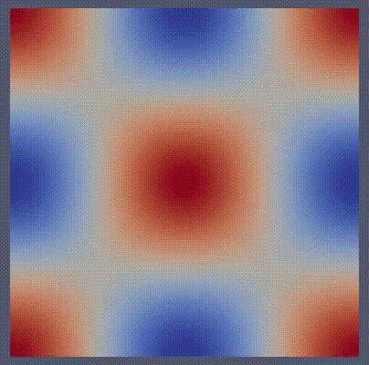

# microTopOpt
Democratizing Microstructures - A Dolphin-Adjoint Code

Optimal Microstructures in just a bit over 100 lines of code. Made possible via Dolfin-Adjoint which automatically calculates the adjoint system for the microscopic elasticity problem.

# Install & Run

Step 1: [Install Anaconda](https://docs.continuum.io/anaconda/install/)

Step 2: Create a „fenicsproject“ virtual environment, [install FEniCS](https://fenicsproject.org/download/), activate the virtual environment and install Matplotlib, IPOPT and Dolfin-Adjoint

		conda create -n fenicsproject -c conda-forge fenics
		conda activate fenicsproject
		conda install -c conda-forge cyipopt
		conda install -c conda-forge matplotlib
		pip install git+https://github.com/dolfin-adjoint/pyadjoint.git@2019.1.0
		conda install -c conda-forge dolfin-adjoint
       
Step 3: Clone the repositoy, navigate to the python file and start the FEniCS program via

		git clone https://github.com/ebeling-rump/microTopOpt.git
		cd microTopOpt
		python microTopOpt.py
  
# Results

The first video shows the result of the program as is. The goal is to create a microstructure, which leads to a negative Poisson ratio of the homogenized macrostructure. In other words: If the structure is pulled apart horizontally, it will stretch vertically. 

  

The second video follows the same incentive, but shows how different parameters can influence the final design. It is run with a larger Volume Constraint of 60% instead of 40%, the number of iteration steps is increased from 50 to 500 and the initial state has less holes. Note that this a shifted version of the result in 
[Design and testing of 3D-printed micro-architectured polymer materials exhibiting a negative Poisson’s ratio](https://doi.org/10.1007/s00161-019-00851-6)

  

